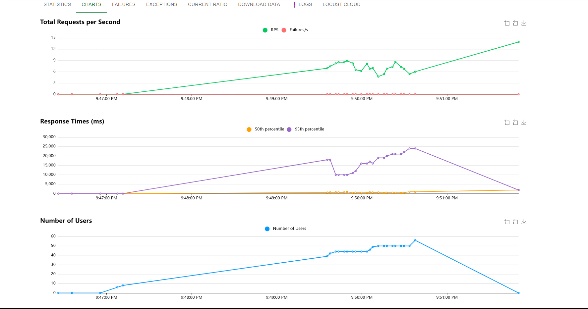
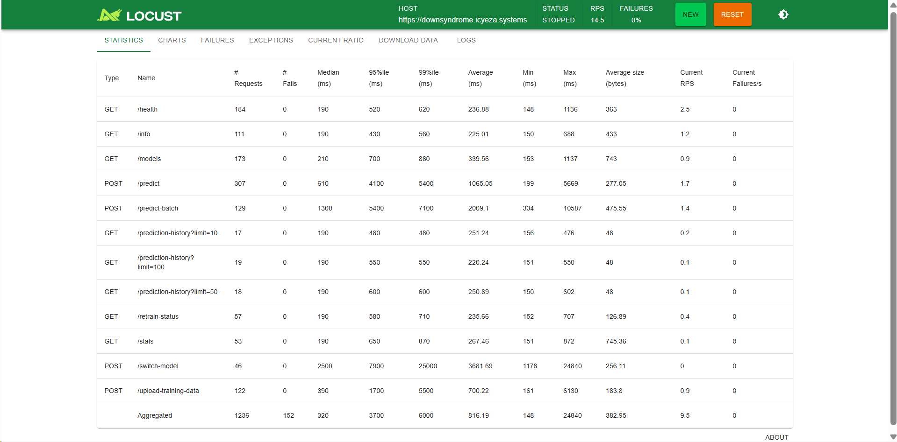

# Down Syndrome Image Classification

A machine learning project that classifies images of individuals with and without Down Syndrome using transfer learning with MobileNetV2.

## Project Structure

Here is the basic layout of the repository:

```text
downsyndrome/
│
├── README.md                 # Project documentation
├── requirements.txt          # Python dependencies
├── pyproject.toml            # Project metadata and configurations
├── docker-compose.yml        # Docker composition for API and UI
├── Dockerfile                # Dockerfile for the prediction API
├── ui.Dockerfile             # Dockerfile for the frontend UI
│
├── notebook/
│   └── down_syndrome.ipynb   # Jupyter Notebook for data exploration, training, and evaluation
│
├── src/
│   ├── preprocessing.py      # Image preprocessing, resizing, and augmentation
│   ├── model.py              # Model architecture and configuration
│   └── prediction.py         # Scripts to generate predictions from new images
│
├── api/
│   └── app.py                # Backend REST API for serving model inferences
│
├── ui/
│   ├── index.html            # Web dashboard interface
│   └── dashboard.js          # Logic linking the UI to the inference API
│
├── data/
│   ├── binary/               # Raw binary dataset (downSyndrome / noDownSyndrome)
│   ├── train/                # Processed training split
│   └── test/                 # Processed testing/holdout split
│
└── models/                   # Saved models, label mappings, and configuration files
    ├── downsyndrome_classifier.keras
    ├── active_model.txt
    └── model_config.json
```

## Overview

This project uses a pre-trained **MobileNetV2** that is fine-tuned on the provided image dataset. Key features include:

- **Data Augmentation**: Applies random flips, rotations, zooming, and contrast adjustments to reduce overfitting.
- **Data Visualizations**: Explores color channel distribution, brightness, and contrast between the classes.
- **Model Retraining System**: A script that tracks when the model needs retraining based on accuracy drops, new dataset uploads, or elapsed time.

## Installation & Setup

### 1. Local Python Setup

Clone the code and navigate to the project directory:

```bash
cd downsyndrome
python -m venv venv
source venv/bin/activate  # On Windows: venv\Scripts\activate
pip install -r requirements.txt
```

### 2. Docker Setup

To start the API and the UI dashboard simultaneously, use Docker Compose:

```bash
docker-compose up --build
```

This starts the backend (from `Dockerfile`) and the frontend (from `ui.Dockerfile`).

## Usage

### 1. Exploration & Training

Start the Jupyter Notebook to rerun the ML pipeline from scratch, view data distribution, train the model, and track performance.

```bash
jupyter notebook notebook/down_syndrome.ipynb
```

The notebook automatically saves the trained models to the `models/` directory so the API can use them.

### 2. Scripts (`src/`)

Use the python modules to run predictions locally:

- `src/preprocessing.py`: Import functions here to process images so they match the `224x224` shape required by MobileNetV2.
- `src/prediction.py`: Use this to load the `.keras` model and score new images.

### 3. API Inference

If testing the API standalone:

```bash
python api/app.py
```

Once running, it accepts image uploads and returns a JSON response containing the confidence scores and class predictions.

## Automated Retraining

The notebook includes a `RetrainingTrigger` class. It flags when the model should be retrained if:

1. Training accuracy drops below a specific threshold (e.g., 80%).
2. Enough new training samples (e.g., 50 new photos) have been uploaded to the system.
3. A set amount of time (e.g., 7 days) has passed since the last training run.

## Load Testing with Locust

We used Locust for performance testing to simulate user traffic and validate the robustness of the API under load.

### Setup

Install Locust and run the load test:

```bash
pip install locust
locust -f locustfile.py --host=http://downsyndrome.icyeza.systems
```

Then open `http://localhost:8089` in your browser to access the Locust dashboard.

### Locust Dashboard

**Request Rate, Response Times, and User Load Over Time**



**Endpoint-wise Performance Statistics**


